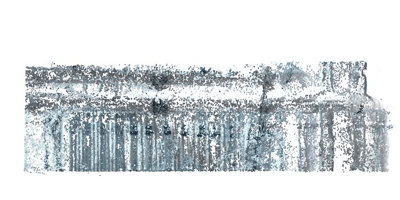

# NeRF-vs-SFM

### Case-study: An indoor environment is captured using FARO scanner (left) and reconstructed by NeRF and SfM
|  |  |  |
|:--:|:---:|:---:|
| Laser Scan | NeRF | SFM |


### Comparison-1
|  |  |  |
|:--:|:---:|:---:|
| Laser Scan | NeRF | SFM |
| C2C distance | 2.56 cms | 2.86 cms |

**C2C distance**:  denotes cloud-to-cloud distance which is simply the nearest neighbor distance. It is obtained by aligning the reconstructed 3D point cloud with Laser scan (Ground Truth). Higher value means poorer reconstruction.

### Comparison-2
|  |  |  |
|:--:|:---:|:---:|
| Laser Scan | NeRF | SFM |
| C2C distance | 5.83 cms | 2.33 cms |


### Comparison-3
|  |  |  |
|:--:|:---:|:---:|
| Laser Scan | NeRF | SFM |
| C2C distance | 5.08 cms | 0.91 cms |

SfM preserved the planarity of points. In contrast, points in NeRF were widely spread-out resulting in a sort of hazy/cloudy reconstruction.


#### Libraries and Tools used  - [Nerfstudio](https://github.com/nerfstudio-project/nerfstudio), [Colmap](https://colmap.github.io/), [CloudCompare](https://www.danielgm.net/cc/)

Please refer paper for more detailed analysis and discussion:
```
@inbook{doi:10.1061/9780784485224.052,
author = {Mohit Gupta  and Andre Borrmann  and Thomas Czerniawski },
title = {Comparison of 3D Reconstruction between Neural Radiance Fields and Structure-from-Motion-Based Photogrammetry from 360° Videos},
booktitle = {Computing in Civil Engineering 2023},
chapter = {},
pages = {429-436},
doi = {10.1061/9780784485224.052},
URL = {https://ascelibrary.org/doi/abs/10.1061/9780784485224.052},
eprint = {https://ascelibrary.org/doi/pdf/10.1061/9780784485224.052},
    abstract = { Imagery is a standard modality of visual data capture on construction sites for documenting construction progress. Assimilating the data from multiple disjointed 2D images into a single 3D format enhances visualization and scene understanding and increases the data usability for tasks like quantity estimation and progress tracking. Two popular methods for 3D reconstruction are structure-from-motion (SfM)-based photogrammetry and neural radiance fields (NeRF), a neural network-based technique in computer vision. In this paper, we compare the spatial geometric accuracy of 3D reconstruction from 360° videos of construction sites using the SfM library called Colmap and NeRF. Our experiments show that 3D reconstruction from conventional photogrammetry is sharper than NeRF and more accurate in capturing object details and boundaries. }
}
```
