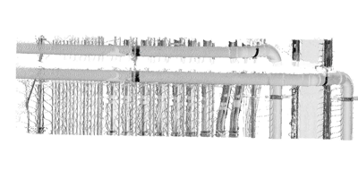
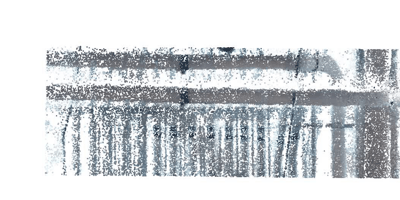

# NeRF-vs-SFM

### Case-study: An indoor environment is captured using FARO scanner (left) and reconstructed by NeRF and SfM
|  |  |  |
|:--:|:---:|:---:|
| Laser Scan | NeRF | SFM |

### Comparison-1
|  |  |  |
|:--:|:---:|:---:|
| Laser Scan | NeRF | SFM |

Libraries and Tools used  - Nerfstudio, small_colmap
